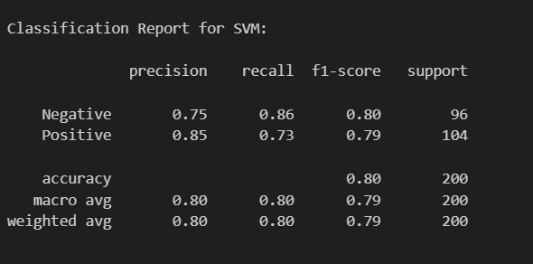
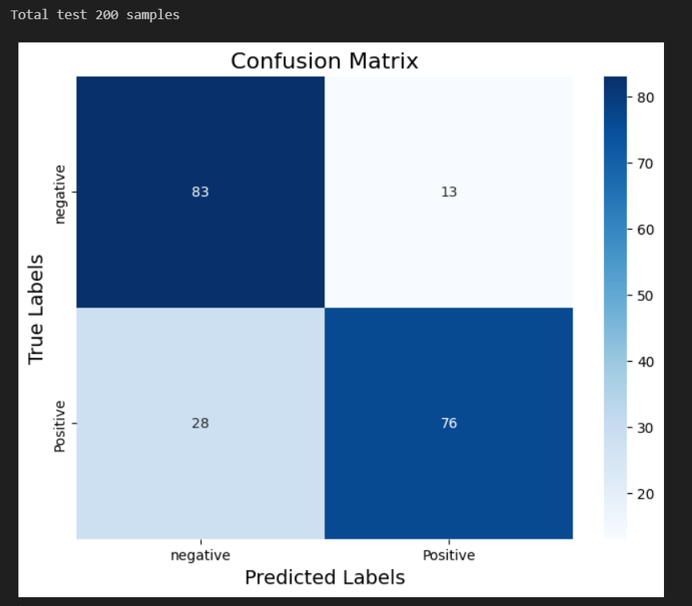
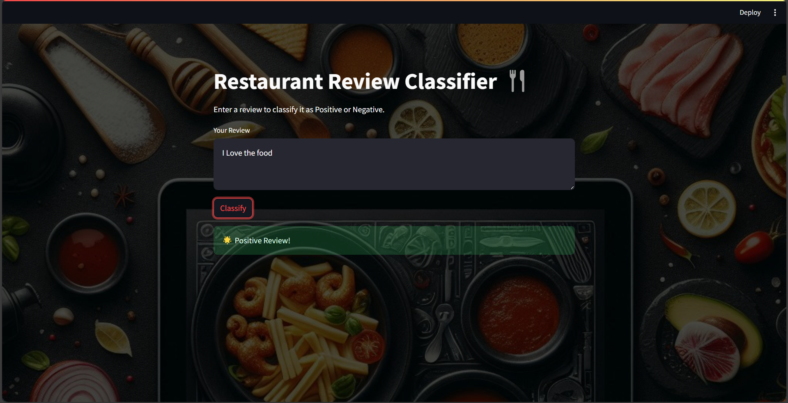
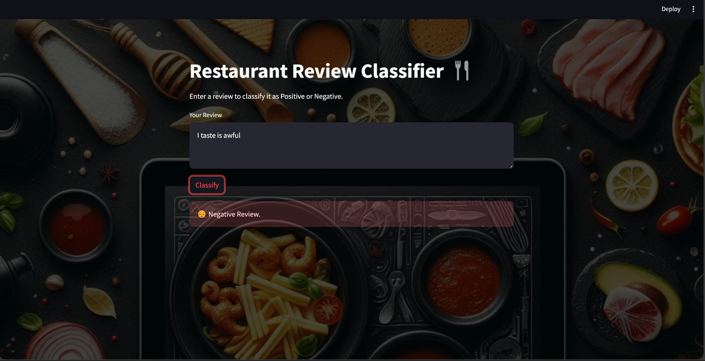

# Sentiment Analysis on Restaurant Reviews

This project focuses on analyzing restaurant reviews using **TF-IDF (Term Frequency-Inverse Document Frequency)** for feature extraction and **Support Vector Machine (SVM)** for sentiment classification. The goal is to classify reviews as either positive or negative based on their content.

## Table of Contents
1. [Problem Statement](#problem-statement)
2. [Technology Used](#technology-used)
3. [Approach](#approach)
4. [Results](#results)
---

## Problem Statement
Restaurant reviews are a valuable source of feedback for businesses and customers alike. However, manually analyzing large volumes of reviews is time-consuming and inefficient. This project aims to automate the process of sentiment analysis by classifying restaurant reviews as positive or negative using machine learning techniques.

---

## Technology Used
- **Programming Language**: Python
- **Libraries**: 
  - `scikit-learn` for TF-IDF and SVM
  - `pandas` for data manipulation
  - `numpy` for numerical operations
  - `matplotlib` and `seaborn` for visualization
- **Tools**: Jupyter Notebook, Git

---

## Approach
1. **Data Preprocessing**:
   - Cleaning the text data (removing stopwords, punctuation, etc.).
   - Tokenization and stemming/lemmatization.
2. **Feature Extraction**:
   - Using TF-IDF to convert text data into numerical features.
3. **Model Training**:
   - Training an SVM classifier on the preprocessed data.
4. **Evaluation**:
   - Evaluating the model using metrics like accuracy, precision, recall, and F1-score.
5. **Visualization**:
   - Plotting a confusion matrix and other relevant graphs.

---

## Results
- **Accuracy**: The model achieved an accuracy of **79.5%** on the test dataset.
- **Classification Report**:
  
- **Confusion Matrix**:
   
-**Streamlit interface**:
  
  