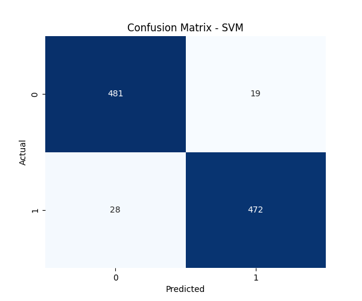
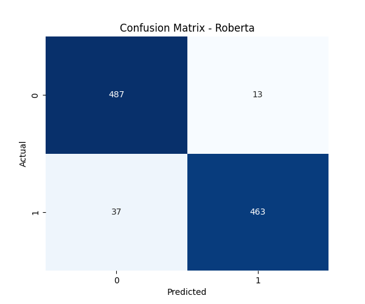

# Sentiment Analysis on Restaurant Reviews (ML and  Transformers)

This project focuses on analyzing restaurant reviews using both **Classic Machine Learning (SVM with TF-IDF)** and **State-of-the-Art Transformers (Roberta)**. The goal is to classify reviews as either positive or negative based on their content, allowing users to compare the performance of traditional vs. modern NLP techniques.

## Table of Contents
1. [Problem Statement](#problem-statement)
2. [Technology Used](#technology-used)
3. [Approach](#approach)
4. [Results & Comparison](#results-comparison)

---

## Problem Statement
Restaurant reviews are a valuable source of feedback for businesses and customers alike. However, manually analyzing large volumes of reviews is time-consuming and inefficient. This project aims to automate the process of sentiment analysis using two distinct approaches: a lightweight Support Vector Machine (SVM) and a powerful Roberta Transformer model.

---

## Technology Used
- **Programming Language**: Python
- **Libraries**: 
  - `scikit-learn` for TF-IDF and SVM
  - `transformers` (Hugging Face) for Roberta
  - `torch` for deep learning backend
  - `pandas` for data manipulation
  - `numpy` for numerical operations
  - `matplotlib` and `seaborn` for visualization
- **Tools**: Streamlit (Web App), Jupyter Notebook

---

## Approach

### 1. Traditional ML (SVM)
- **Data Preprocessing**: Cleaning text (removing stopwords, punctuation, lemmatization).
- **Feature Extraction**: TF-IDF (Term Frequency-Inverse Document Frequency).
- **Model**: Linear Support Vector Machine (SVM).

### 2. Deep Learning (Roberta)
- **Model**: Pre-trained `cardiffnlp/twitter-roberta-base-sentiment` model.
- **Inference**: Direct processing of raw text (tokenization handled by the model) to predict sentiment scores.
- **Mapping**: Converting model outputs (Negative/Neutral/Positive) to binary sentiment (Positive/Negative).

---

## Results Comparison

We evaluated both models on the `Restaurant_Reviews.tsv` dataset. Below is the side-by-side comparison of their confusion matrices.

### Confusion Matrices

| **SVM Model** | **Roberta Model** |
|:---:|:---:|
|  |  |

> The Roberta model generally leverages contextual understanding better than the frequency-based approach used by SVM, though it requires more computational resources.

>There is no high difference between results so we can use any of the models.

### Streamlit Interface
The application now provides a model selection sidebar:
- **ML (SVM)**: Fast, traditional approach.
- **Transformer (Roberta)**: 3-class prediction [Positive, Neutral, Negative], modern approach.

